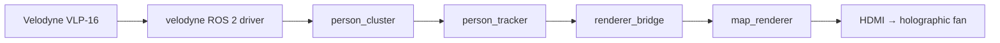
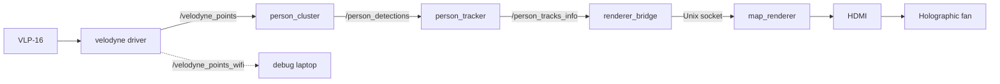

# Takemura Holographic Project (2026)

### Real-time LiDAR human tracking rendered on a holographic fan display

[Overview](#overview) • [Architecture](#architecture) • [Steps to Build](#steps-to-build) • [Usage](#usage) • [Implementation Details](#implementation-details) • [Results](#results) 

---

## Overview

This project detects people walking through a room using a 3D LiDAR, tracks their positions over time, and renders fading "footprint" trails onto a holographic fan display in real time.

**Pipeline at a glance:**

```
VLP-16 LiDAR → velodyne ROS 2 driver → person_cluster → person_tracker → renderer_bridge → map_renderer → HDMI → holographic fan
```

---


## Features

- Real-time multi-person detection and tracking from raw 3D point clouds
- Floor-plane calibration and EMA background subtraction for robust foreground extraction
- Euclidean clustering with human-shape gating to filter non-person clusters
- Fading footprint-trail visualization rendered via Raylib
- Runs on a Raspberry Pi 5 for a self-contained, deployable unit

---


## Architecture




The LiDAR and processing pipeline fully run on a Raspberry Pi 5 (Ubuntu Server). It is a headless box: SSH in from a laptop for development, then close the session. The exhibit itself does not need Wi-Fi.

```bash
ssh user@hostname
```

Every ROS 2 process on this project uses **domain 42**. If they do not share that ID they will never see each other (empty map, no footprints). The launch script sets it for you; for extra terminals, export it first:

```bash
export ROS_DOMAIN_ID=42
source /opt/ros/jazzy/setup.zsh          # bash: setup.bash
source ~/Takemura-Holographic-Project-2026/project_ws/install/setup.zsh
```

To make that permanent on the Pi, add the same three lines to `~/.zshrc` (or `~/.bashrc`).

---


## Steps to Build

There are two binaries. Build both **on the machine that will run them** (the Pi for the fan, the Mac for bag replay). Copying source from the Mac is not enough.


| Binary                               | Path            | Tool   |
| ------------------------------------ | --------------- | ------ |
| Footprint map (`renderer`)           | `map_renderer/` | CMake  |
| ROS nodes (cluster, tracker, bridge) | `project_ws/`   | colcon |


### Prerequisites


| Component | Version / Notes                                      |
| --------- | ---------------------------------------------------- |
| ROS 2     | Jazzy                                                |
| OS (Pi)   | Ubuntu Server 24.04, Raspberry Pi 5                  |
| LiDAR     | Velodyne VLP-16 on **Ethernet** (`/velodyne_points`) |
| Display   | HDMI holographic fan at 1920×1080                    |
| C++       | 17+                                                  |
| CMake     | 3.16+                                                |
| PCL       | via `ros-jazzy-pcl-conversions`                      |
| Raylib    | fetched by CMake if not installed                    |


### 1. Clone the repository

```bash
git clone https://github.com/Linn-Pyae/Takemura-Holographic-Project-2026
cd ~/Takemura-Holographic-Project-2026
```


### 2. ROS environment

On the Pi (system ROS):

```bash
source /opt/ros/jazzy/setup.zsh    # bash: setup.bash
export ROS_DOMAIN_ID=42
```

On a Mac (RoboStack / micromamba), activate the env first, then the same domain:

```bash
micromamba activate ros_view
export ROS_DOMAIN_ID=42
```


### 3. Build


#### 3.1 Map renderer

After editing `map_renderer/src/main.cpp`, textures, or fonts:

```bash
cd ~/Takemura-Holographic-Project-2026/map_renderer
cmake -S . -B build          # first time, or after CMakeLists.txt changes
cmake --build build -j3
```


#### 3.2 ROS workspace

```bash
cd ~/Takemura-Holographic-Project-2026/project_ws
colcon build
source install/setup.zsh     # bash: install/setup.bash
```

Rebuild only what you changed:

```bash
colcon build --packages-select person_cluster
colcon build --packages-select person_tracker
colcon build --packages-select renderer_bridge
source install/setup.zsh
```


| You edited                    | Rebuild                                          |
| ----------------------------- | ------------------------------------------------ |
| `map_renderer/src/main.cpp`   | `cmake --build build -j3` in `map_renderer/`     |
| `person_cluster`              | `colcon build --packages-select person_cluster`  |
| `person_tracker`              | `colcon build --packages-select person_tracker`  |
| `renderer_bridge`             | `colcon build --packages-select renderer_bridge` |
| `scripts/run_bag_map.sh` only | nothing — restart the service                    |


### 4. Install as a systemd service (Pi, once)

Do this **once** after a successful build, on the Pi, as the user that owns the repo. Do **not** leave the map running from an SSH terminal: closing that window used to kill tracking.

```bash
cd ~/Takemura-Holographic-Project-2026/project_ws
sudo ./scripts/install_pi_autostart.sh
```

That script installs two units:

- `takemura-x` — Xorg on `:0` (HDMI to the fan)
- `takemura-map` — cluster + tracker + bridge + renderer

It also enables linger and `RemoveIPC=no`, so Fast DDS shared memory is not deleted when you log out of SSH.

After any rebuild, restart so the running process picks up the new binary:

```bash
sudo systemctl restart takemura-map
```


### 5. Hardware

- **VLP-16 → Pi Ethernet.** Live mode subscribes to `/velodyne_points` on the Pi. The thinned `/velodyne_points_wifi` topic is only for remote debug viewers.
- **Fan → Pi HDMI.** The renderer opens fullscreen on `DISPLAY=:0` at 1920×1080.
- **Wi-Fi is optional.** It is only for SSH. Unplugging Wi-Fi does not stop the exhibit. Unplugging the LiDAR Ethernet cable does.

The Velodyne ROS driver should already be running as its own systemd units (`velodyne-driver`, `velodyne-pointcloud`). `takemura-map` waits for those if they exist.

---


## Usage


### Raspberry Pi (exhibit)

Preferred: let systemd own the process. It survives SSH logout and reboot.

```bash
sudo systemctl start takemura-map
sudo systemctl stop takemura-map
sudo systemctl restart takemura-map
sudo systemctl status takemura-map
journalctl -u takemura-map -f
```

Boot on/off:

```bash
sudo systemctl enable takemura-x takemura-map
sudo systemctl disable takemura-x takemura-map
```

If `takemura-map` is already active, `./scripts/run_bag_map.sh pi` will refuse to start. That is intentional — a hand-started run fights the service for HDMI and ROS, then dies when you close SSH.

```bash
# one-off manual run only for debugging:
sudo systemctl stop takemura-map
./scripts/run_bag_map.sh pi
```


### Mac (dev / bag replay)

```bash
micromamba activate ros_view
export ROS_DOMAIN_ID=42
cd ~/Takemura-Holographic-Project-2026/project_ws
source install/setup.zsh

./scripts/run_bag_map.sh                     # live (needs the Wi-Fi LiDAR topic)
./scripts/run_bag_map.sh mac lidar_sample    # recorded bag
```

Close the map window or Ctrl+C to stop.

### ROS domain

```bash
export ROS_DOMAIN_ID=42
```

Live LiDAR, bag replay, and every `ros2 topic` / `ros2 node` command must use **42**. A laptop on domain 0 will not see the Pi.

Check that nodes can see the cloud:

```bash
export ROS_DOMAIN_ID=42
source /opt/ros/jazzy/setup.zsh
ros2 topic hz /velodyne_points
ros2 topic list
```


### Topics

Live exhibit path (Pi). The cluster node remaps `/velodyne_points_bag` onto `/velodyne_points`. `/velodyne_points_wifi` is a thinned copy for remote debug only — the fan pipeline does not use it.




| Topic                   | What it is                           |
| ----------------------- | ------------------------------------ |
| `/velodyne_points`      | Full live cloud on the Pi (Ethernet) |
| `/velodyne_points_wifi` | Thinned cloud for remote debug only  |
| `/person_detections`    | Cluster centroids                    |
| `/person_tracks`        | Tracked people                       |
| `/person_tracks_info`   | Names / IDs for the map labels       |


### View and trail (fan)

Pan / zoom / rotation are four numbers in `/tmp/takemura-view` (`pan_x pan_y zoom rotation`). The launcher restores the last saved view from `~/.config/takemura-view`.

```bash
echo "130 -50 0.8 180" > /tmp/takemura-view
```

Footprint lifetime is `TAKEMURA_TRAIL_SECONDS` in `project_ws/scripts/run_bag_map.sh` (currently 2). After changing it:

```bash
sudo systemctl restart takemura-map
```

---


## Implementation Details


### 1. Person Cluster Node

A ROS2 node that detects walking people from a Velodyne LiDAR point cloud and publishes their positions as a `PoseArray`. Built for a fixed, stationary sensor (e.g. wall/ceiling mounted), not a moving robot platform.

#### 1.1 Overview

The node distinguishes people from static clutter (walls, furniture, equipment) using a background subtraction model, then filters detected blobs by human body shape, and finally requires a blob to demonstrate real movement over several frames before it's reported. This suppresses both static objects and single-frame sensor noise.

**Input:** `/velodyne_points_bag` (`sensor_msgs/msg/PointCloud2`)
**Output:** `/person_detections` (`geometry_msgs/msg/PoseArray`)

#### 1.2 Pipeline Explanation

[Person cluster pipeline](project_ws/src/person_cluster/src/README.md)

### 2. Person Tracker

A ROS 2 node (`track_node.py`) that turns anonymous detection centroids into stable tracks with IDs and display names. Matching uses the Hungarian algorithm; motion prediction uses a constant-velocity Kalman filter (`motion.py`).

**Input:** `/person_detections` (`geometry_msgs/msg/PoseArray`)  
**Output:** `/person_tracks` (`PoseArray`), `/person_tracks_info` (JSON names / IDs)

#### 2.1 Pipeline Explanation

[Multi-object tracker](project_ws/src/person_tracker/person_tracker/mot/README.md)

### 3. Map Renderer

Raylib parchment map that places distance-spaced, fading footprints from live Unix-socket person updates (or a demo track when IPC is unavailable).

#### 3.1 Pipeline Explanation

[Map renderer](map_renderer/src/README.md)

## Results

Placeholder

---


## Acknowledgments

Built at the [Takemura Human Sensing Lab](https://takemura-lab.org/), Tokai University.

## License

[MIT](LICENSE)